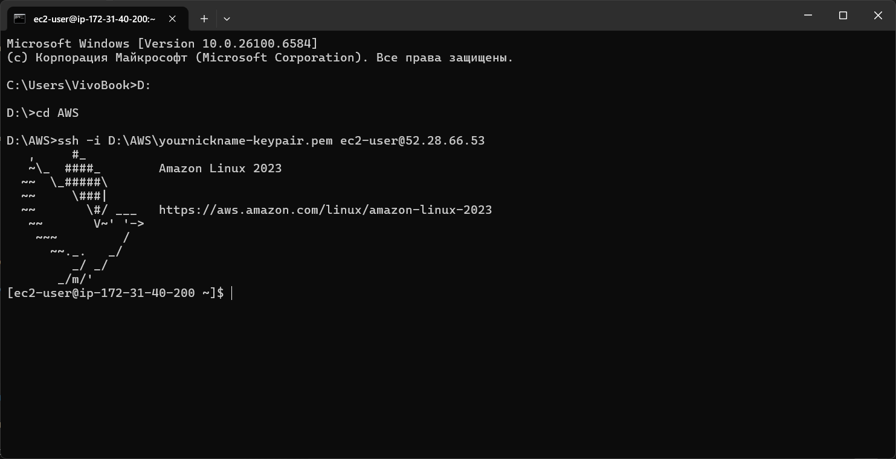

# Лабораторная работа №2. Введение в AWS. Вычислительные сервисы

## 1. Постановка задачи
Познакомиться с основными вычислительными сервисами AWS, научиться создавать и настраивать виртуальные машины (EC2), развёртывать простые веб-приложения, а также работать с веб-сервисами в Docker-контейнерах.

## 2. Цель и основные этапы работы
**Цель:** освоить работу с AWS EC2, IAM, настройку бюджетов, веб-серверов и PHP-приложений.  
**Основные этапы работы:**
1. Создание IAM группы и пользователя с правами администратора.
2. Настройка Zero-Spend Budget для контроля расходов.
3. Создание и запуск EC2-инстанса с Amazon Linux AMI.
4. Логирование и мониторинг инстанса.
5. Подключение к EC2 по SSH.
6. Развёртывание веб-приложения:
   - статического сайта на HTML;
   - PHP-сайта с Nginx и PHP-FPM;
   - PHP-приложения с MySQL и Adminer в Docker.
7. Проверка работы веб-приложения и Adminer.

---

## 3. Практическая часть

### 3.1. Создание IAM группы и пользователя
- Группа `Admins` с политикой `AdministratorAccess` была создана ранее на парах.
- Создан пользователь `cloudstudent`, добавлен в группу `Admins`.
- Подтверждена работа через AWS Management Console под новым IAM пользователем.

**Контрольный вопрос:**  
_Что делает политика `AdministratorAccess`?_  
- Предоставляет полный доступ ко всем ресурсам AWS, включая управление EC2, S3, IAM и другими сервисами.

---

### 3.2. Настройка Zero-Spend Budget
- Бюджет `ZeroSpend`была создана ранее на парах.  

---

### 3.3. Создание и запуск EC2 экземпляра
- Инстанс `webserver` на Amazon Linux 2023 AMI, t3.micro.
- Создан ключ `yournickname-keypair.pem` для безопасного SSH-доступа.
- Настроена Security Group `webserver-sg`:
  - HTTP 80/tcp — открыто всем;
  - SSH 22/tcp — открыт только для моего IP.
- В User Data добавлен скрипт для установки `htop` и `nginx`:

```bash
#!/bin/bash
dnf -y update
dnf -y install htop
dnf -y install nginx
systemctl enable nginx
systemctl start nginx
````

- EC2 запущен, статус проверен: 2/2 checks passed.
    
- Проверено: сайт Nginx доступен по публичному IP.
    

**Контрольный вопрос:**  
_Что такое User Data и какую роль выполняет скрипт?_

- User Data — это скрипт, который выполняется при первом запуске инстанса. В данном случае он устанавливает необходимые пакеты и запускает веб-сервер.
    

---

### 3.4. Логирование и мониторинг

- Status checks: обе проверки прошли успешно.
    
- Мониторинг через CloudWatch показывает базовые метрики.
    
- Проверка системного лога подтвердила успешную установку пакетов.
    
- Скриншоты консоли подтверждают корректный запуск инстанса.
    

**Контрольный вопрос:**  
_В каких случаях важно включать детализированный мониторинг?_

- Когда требуется точная информация о нагрузке на CPU, память и дисковую активность, например для анализа производительности.
    

---

### 3.5. Подключение к EC2 по SSH

```bash
ssh -i yournickname-keypair.pem ec2-user@<Public-IP>
```

- Подключение выполнено успешно, веб-сервер работает.
    

**Контрольный вопрос:**  
_Почему нельзя использовать пароль для входа по SSH в AWS?_

- AWS использует ключи для безопасного доступа, что предотвращает возможность подбора пароля и повышает безопасность.
    

---

### 3.6. Развёртывание веб-приложения на PHP и Docker

- Установлен Docker, запущены контейнеры:
    
    - `nginx` — веб-сервер.
        
    - `php-fpm` — обработка PHP-кода.
        
    - `mysql` — база данных `recipe_book`.
        
    - `adminer` — веб-интерфейс для MySQL.
        
- Приложение работает корректно:
    
    - Сайт доступен по `http://<Public-IP>`.

    - При каждой перезагрузке виртуальной машины `Public-IP` меняется
        
    - Adminer доступен по `http://<Public-IP>:8080`.
        
- В MySQL добавлены таблицы `categories` и `recipes`, данные о рецептах успешно отображаются на сайте.
    

**Контрольный вопрос:**  
_Что делает Adminer?_

- Adminer предоставляет веб-интерфейс для работы с базой данных (создание таблиц, запросы, редактирование данных).
    

---

### 3.7. Итоги практической работы

- Установлен и настроен EC2-инстанс.
    
- Созданы IAM-пользователи и группа.
    
- Настроен Zero-Spend Budget.
    
- Подключение по SSH выполнено успешно.
    
- Развёрнут PHP-сайт с MySQL в Docker.
    
- Админка Adminer работает.
    

---

## 4. Скриншоты

1. EC2 Status checks
	

    
2. Подключение по SSH
	

	
3. Рабочее веб-приложение
	

    
4. Adminer с таблицами `categories` и `recipes`
    

	

---

## 5. Список использованных источников

1. [AWS Documentation](https://docs.aws.amazon.com/)
    
2. [Docker Documentation](https://docs.docker.com/)
    
3. Лекции и материалы по AWS и PHP
    

---

## 6. Дополнительные аспекты

- Все данные хранятся в базе MySQL, что обеспечивает структурированное хранение и возможность масштабирования.
    
- Использование Docker позволяет изолировать сервисы и быстро разворачивать приложение.
    
- Настройка безопасности через IAM и Security Groups предотвращает несанкционированный доступ.
