# Отчёт по лабораторной работе №3
## «Облачные сети (AWS VPC)»


## Цель работы

Изучить принципы построения виртуальных сетей в облаке AWS.
Научиться создавать VPC, подсети, таблицы маршрутов, Internet и NAT Gateway, а также безопасно соединять публичные и приватные ресурсы (через Bastion Host).

---

## Используемое окружение

* **AWS Account**
* **Регион:** `eu-central-1 (Frankfurt)`
* **Инструменты:** AWS Console, EC2, VPC, SSH
* **ОС инстансов:** Amazon Linux 2023

---

## Этап 1. Создание VPC

1. В разделе **VPC → Your VPCs → Create VPC**

   * **Name:** `student-vpc-k08`
   * **IPv4 CIDR block:** `10.8.0.0/16`
   * **Tenancy:** Default

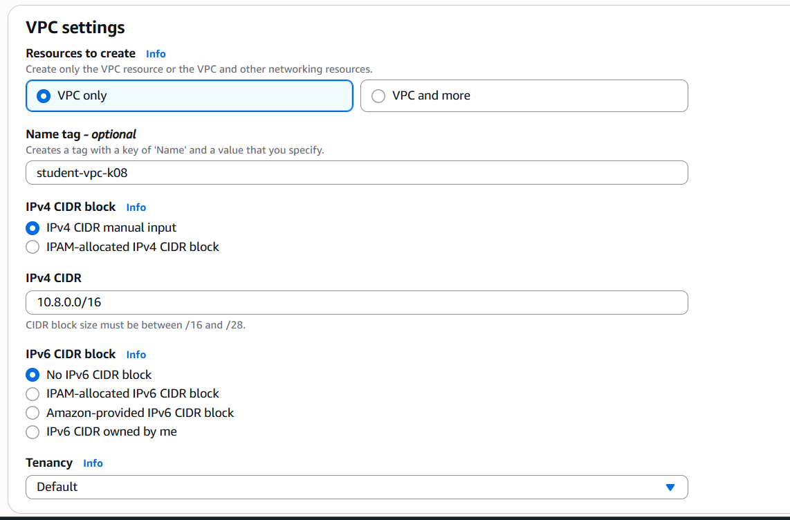

---

## Этап 2. Создание Internet Gateway (IGW)

1. **VPC → Internet Gateways → Create internet gateway**

   * **Name:** `student-igw-k08`

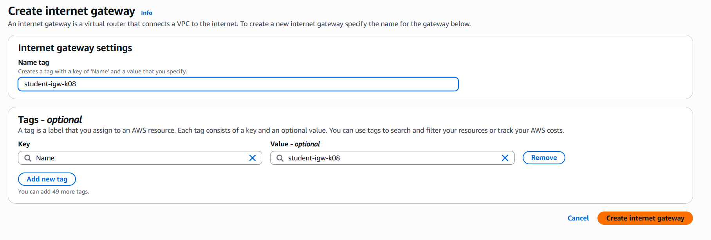

2. После создания → **Attach to VPC → `student-vpc-k08`**

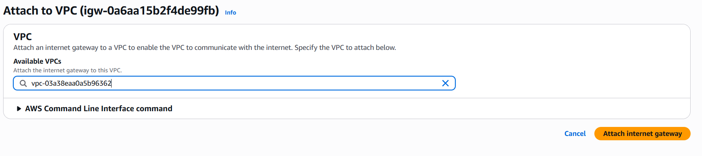

---

## Этап 3. Подсети

### Публичная подсеть

* **Name:** `public-subnet-k08`
* **CIDR:** `10.8.1.0/24`
* **AZ:** `eu-central-1a`

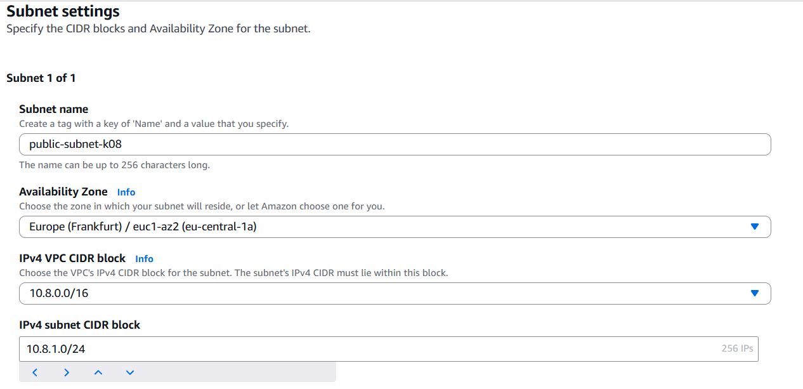

### Приватная подсеть

* **Name:** `private-subnet-k08`
* **CIDR:** `10.8.2.0/24`
* **AZ:** `eu-central-1b`

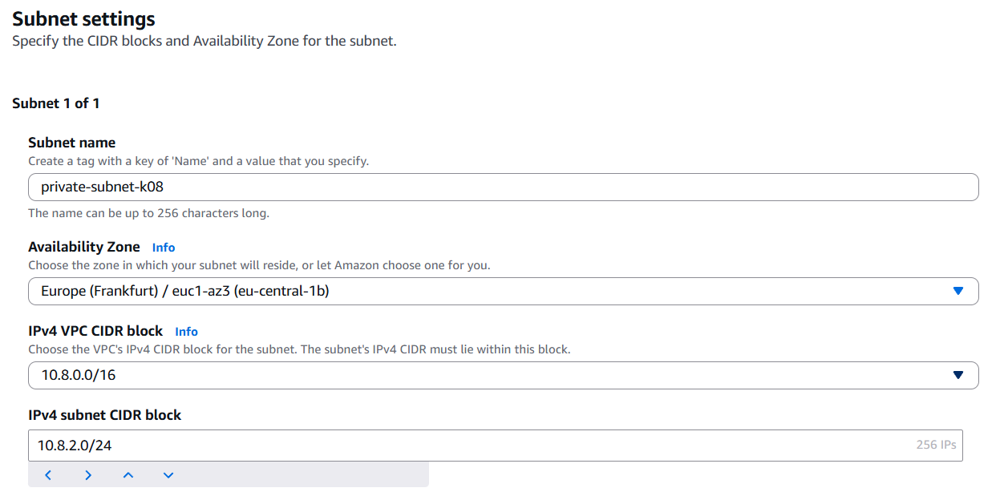

---

## Этап 4. Таблицы маршрутов

### 4.1. Публичная таблица

* **Name:** `public-rt-k08`
* Добавлен маршрут:

  * `0.0.0.0/0` → `student-igw-k08`

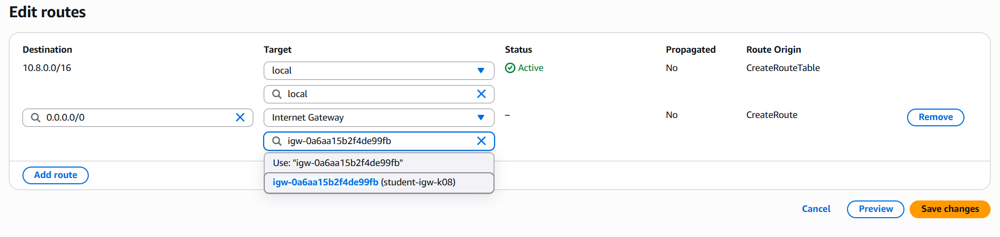

* Привязана к `public-subnet-k08`

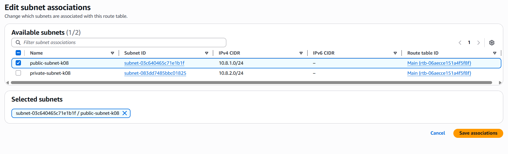

---

### 4.2. Приватная таблица

* **Name:** `private-rt-k08`
* Привязана к `private-subnet-k08`

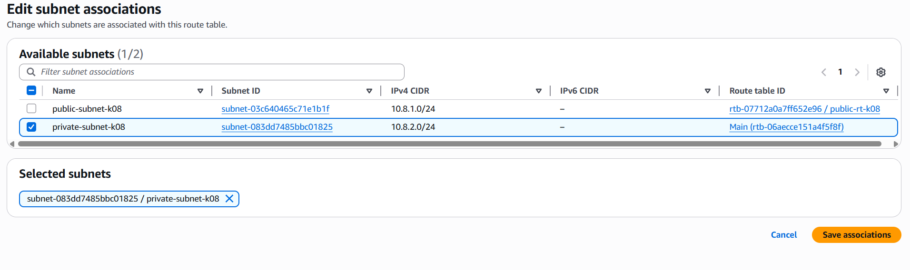

---

## Этап 5. NAT Gateway

### 5.1. Elastic IP

* Создан и закреплён **EIP** → `nat-eip-k08`

### 5.2. NAT Gateway

* **Name:** `nat-gateway-k08`
* **Subnet:** `public-subnet-k08`
* **Elastic IP:** `nat-eip-k08`
* После создания → статус *Available*

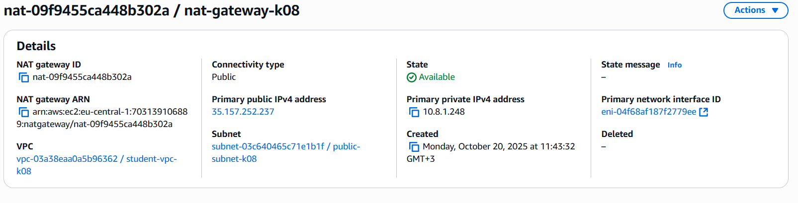

### 5.3. Добавление маршрута для приватной таблицы

* В `private-rt-k08` добавлен маршрут:

  * `0.0.0.0/0` → `nat-gateway-k08`

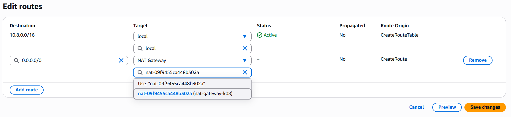

---

## Этап 6. Security Groups

* **Name:** `web-sg-k08`
* **Description:** `Security group for web server`
* **VPC:** `student-vpc-k08`

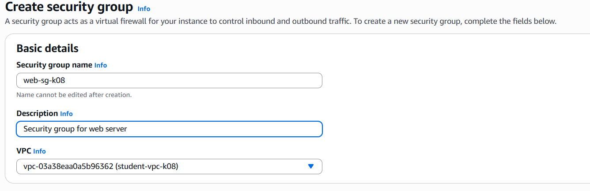

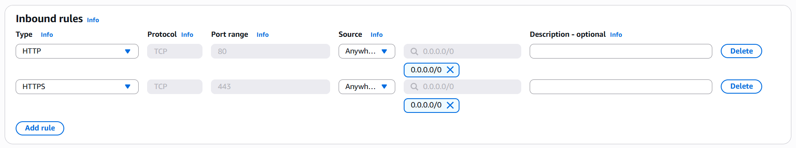

* **Name:** `bastion-sg-k08`
* **Description:** `Security group for bastion`
* **VPC:** `student-vpc-k08`

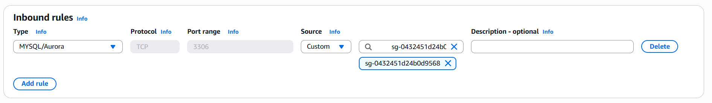

* **Name:** `db-sg-k08`
* **Description:** `Security group for db`
* **VPC:** `student-vpc-k08`

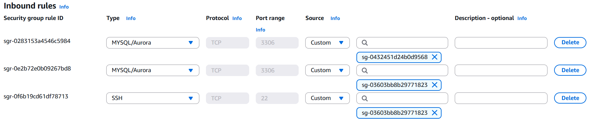

---

## Этап 7. Создание EC2-инстансов

### Web-server

* **Name:** `web-server-k08`
* **Subnet:** `public-subnet-k08`
* **Public IP:** Enabled
* **SG:** `web-sg-k08`
* **User data:**

  ```bash
  #!/bin/bash
  dnf install -y httpd php
  echo "<?php phpinfo(); ?>" > /var/www/html/index.php
  systemctl enable httpd
  systemctl start httpd
  ```

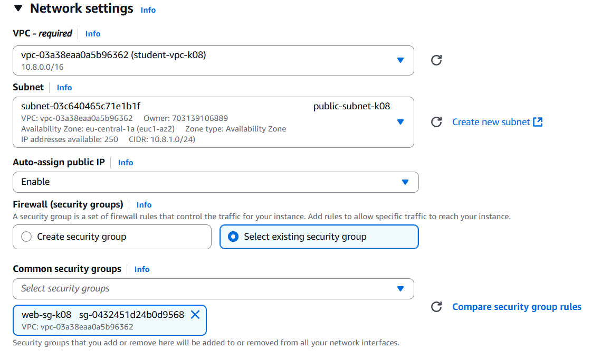

---

### DB-server

* **Name:** `db-server-k08`
* **Subnet:** `private-subnet-k08`
* **Public IP:** Disabled
* **SG:** `db-sg-k08`
* **User data:**

  ```bash
  #!/bin/bash
  dnf install -y mariadb105-server
  systemctl enable mariadb
  systemctl start mariadb
  mysql -e "ALTER USER 'root'@'localhost' IDENTIFIED BY 'StrongPassword123!'; FLUSH PRIVILEGES;"
  ```

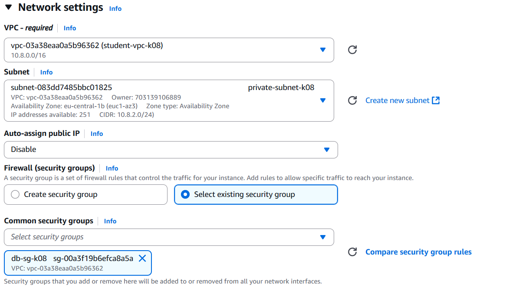

---

### Bastion-host

* **Name:** `bastion-k08`
* **Subnet:** `public-subnet-k08`
* **Public IP:** Enabled
* **SG:** `bastion-sg-k08`
* **User data:**

  ```bash
  #!/bin/bash
  dnf install -y mariadb105
  ```

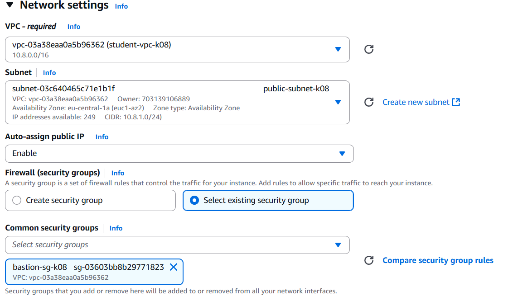

---

## Этап 8. Проверка работы

### Проверка веб-сервера

Открой в браузере:

```
http://3.79.184.113
```

→ отобразилась страница **PHP Info**

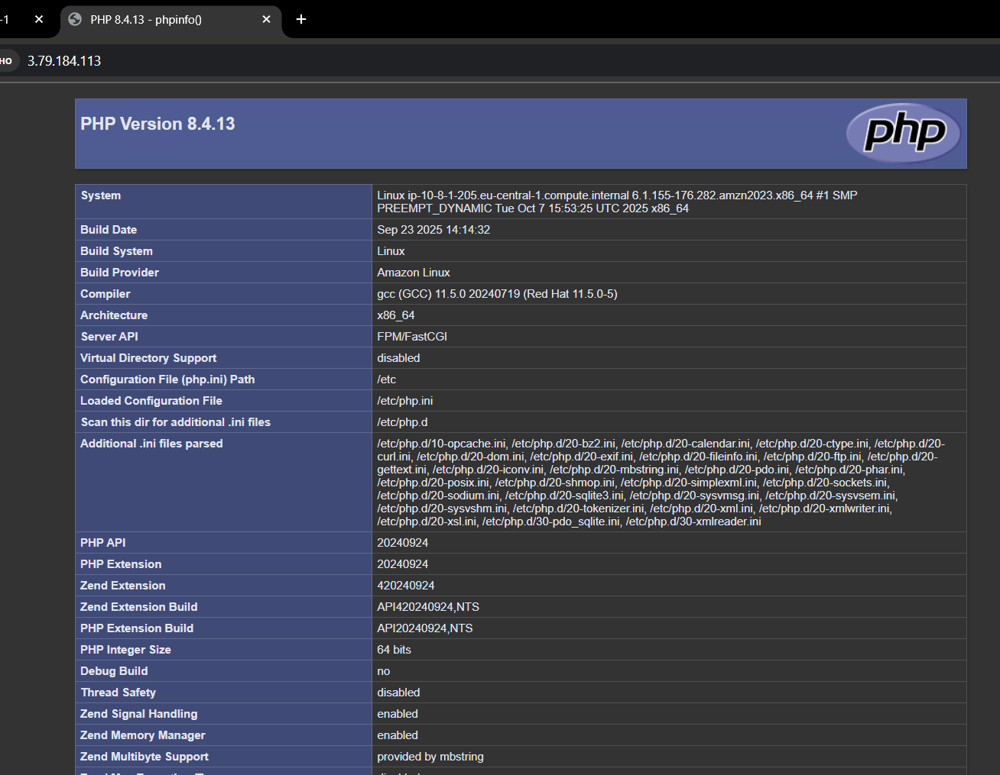

---

### Проверка SSH-доступа

1. Подключение к Bastion Host:

   ```bash
   ssh -i student-key-k08.pem ec2-user@<BastionPublicIP>
   ```
2. Проверка выхода в интернет:

   ```bash
   ping -c 4 google.com
   ```

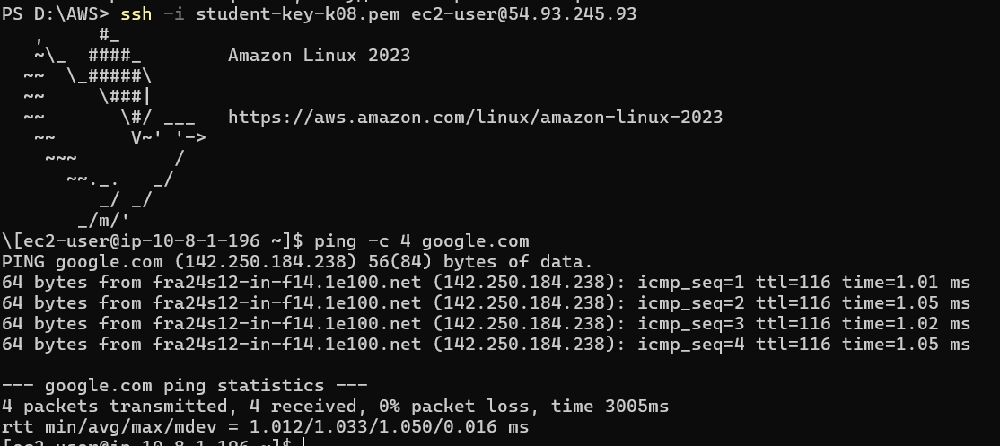

---

### Проверка подключения к БД

С Bastion Host не полкчилось подключиться к БД в приватной сети.

---

## Этап 9. Завершение работы

Для экономии средств:

1. Удалить EC2-инстансы
2. Удалить NAT Gateway
3. Освободить Elastic IP
4. Удалить VPC и Security Groups

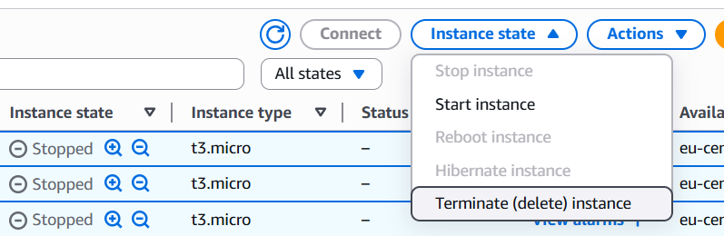
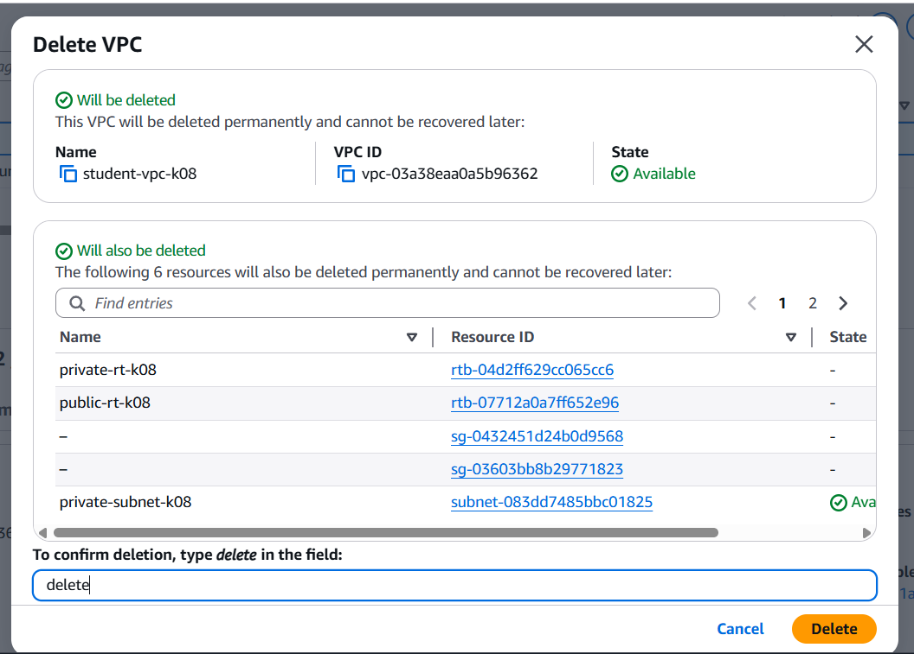

---

## Контрольные вопросы и ответы

| № | Вопрос                                 | Ответ                                                                        |
| - | -------------------------------------- | ---------------------------------------------------------------------------- |
| 1 | Что означает маска /16?                | Сеть с 65 536 IP-адресами (2ⁿ = 65 536).                                     |
| 2 | Почему нельзя /8?                      | Слишком большая сеть, AWS не разрешает /8 (16 млн адресов).                  |
| 3 | Является ли подсеть публичной без IGW? | Нет, пока не привязана таблица маршрутов с IGW.                              |
| 4 | Зачем нужна таблица маршрутов?         | Она определяет, куда направлять трафик (внутрь сети или в Интернет).         |
| 5 | Как работает NAT Gateway?              | Приватные инстансы выходят в Интернет через NAT, используя его публичный IP. |
| 6 | Что такое Bastion Host?                | Промежуточный сервер для безопасного SSH-доступа к приватным ресурсам.       |
| 7 | Что делают флаги `-A` и `-J` в SSH?    | `-A` пересылает ключи, `-J` указывает промежуточный хост (jump host).        |

---

## Вывод

В ходе работы создана собственная облачная сеть (VPC) в AWS, включающая публичную и приватную подсети, интернет-шлюз, NAT Gateway, маршруты и группы безопасности.
Реализована архитектура из трёх инстансов:

* **Web-server** в публичной подсети, доступный по HTTP,
* **DB-server** в приватной подсети,
* **Bastion Host** для безопасного SSH-доступа.

К сожелению не все сервисы функционируют корректно, доступ к **DB-server** не получилось настроить.