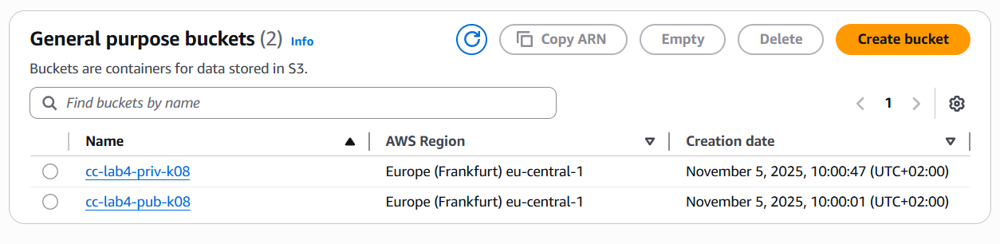
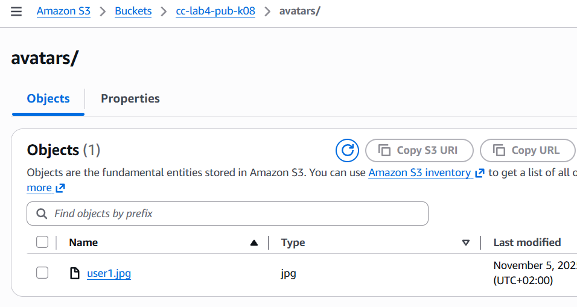
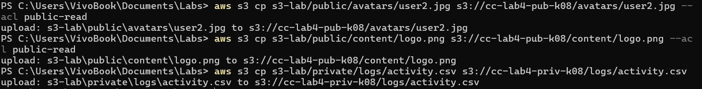
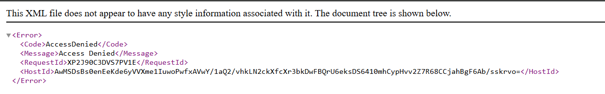
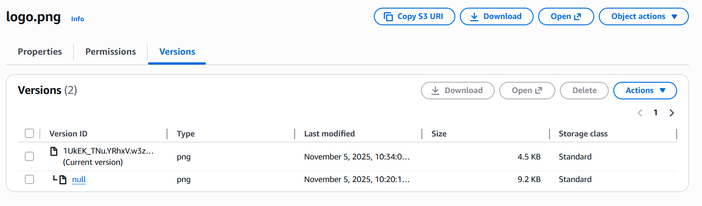
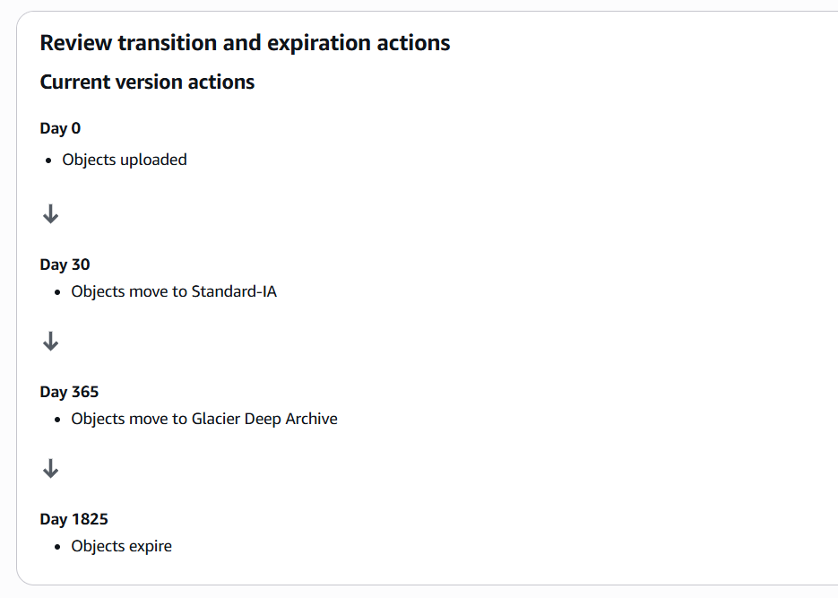
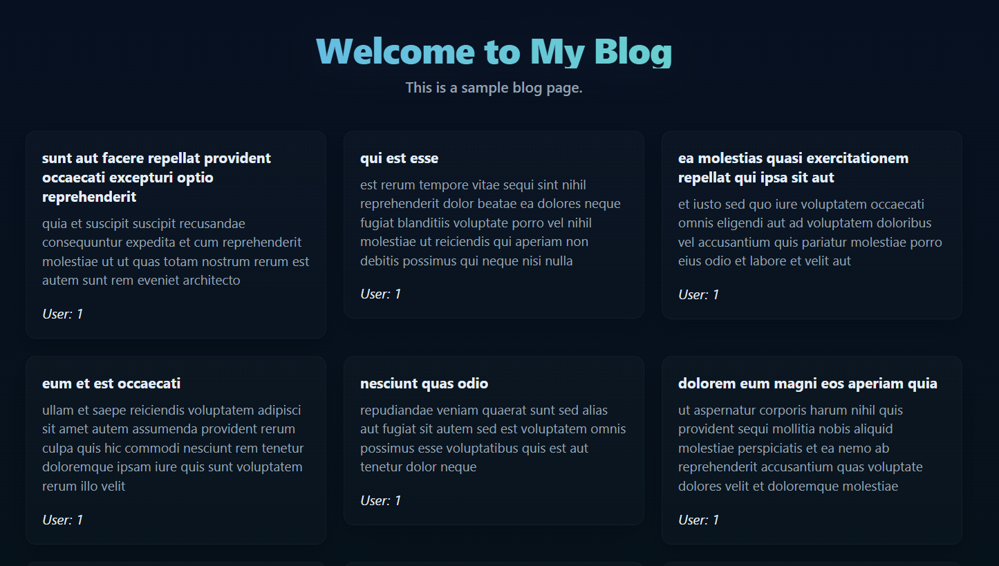

# Лабораторная работа №4. Облачное хранилище данных. Amazon S3

## Постановка задачи

Цель работы — познакомиться с сервисом **Amazon S3 (Simple Storage Service)** и отработать основные операции:

* создание публичного и приватного бакетов;
* загрузка и управление объектами через консоль и AWS CLI;
* настройка версионирования и шифрования;
* развертывание статического сайта;
* применение Lifecycle-правил для архивирования старых данных.

---

## Цель и основные этапы работы

* Понять концепцию объектного хранилища и отличия от блочного и файлового;
* Создать публичный и приватный бакеты;
* Загрузить объекты (аватары, лого, логи);
* Настроить публичный доступ и статический веб-сайт;
* Включить версионирование и Lifecycle-политики.

---

## Практическая часть

### Шаг 1. Подготовка структуры локальных файлов

```
s3-lab/
├── public/
│   ├── avatars/
│   │   ├── user1.jpg
│   │   └── user2.jpg
│   └── content/logo.png
├── private/
│   └── logs/
│       └── activity.csv
└── web/
    ├── index.html
    ├── styles.css
    └── index.js
```

---

### Шаг 2. Создание бакетов

**Публичный бакет:** `cc-lab4-pub-k08`

* Region: `eu-central-1`
* Object Ownership: ACLs enabled
* Block all public access: снята галочка

**Приватный бакет:** `cc-lab4-priv-k08`

* Block all public access: по умолчанию включено

**Скриншот создания бакетов:**


**Контрольный вопрос:**

> Опция *Block all public access* предотвращает доступ к бакету и объектам всем пользователям, кроме владельца. Для публичного контента её снимаем.

---

### Шаг 3. Загрузка объектов через консоль

**Публичный бакет**:

* `avatars/user1.jpg` : публичный доступ
* `content/logo.png` : публичный доступ

**Скриншоты:**


**Контрольный вопрос:**

> Object key — это уникальный идентификатор объекта в бакете. Имя файла — локальное имя, оно может отличаться от ключа.

---

### Шаг 4. Загрузка объектов через AWS CLI

```bash
aws s3 cp s3-lab/public/avatars/user2.jpg s3://cc-lab4-pub-k08/avatars/user2.jpg --acl public-read
aws s3 cp s3-lab/public/content/logo.png s3://cc-lab4-pub-k08/content/logo.png --acl public-read
aws s3 cp s3-lab/private/logs/activity.csv s3://cc-lab4-priv-k08/logs/activity.csv
```

**Контрольный вопрос:**

* `cp` — копирует файл;
* `mv` — перемещает и удаляет исходный;
* `sync` — синхронизирует директории.
* `--acl public-read` делает объект публичным.

**Скриншоты CLI:**


**Ссылки на файлы:**

* [user1.jpg](https://cc-lab4-pub-k08.s3.eu-central-1.amazonaws.com/avatars/user1.jpg)
* [user2.jpg](https://cc-lab4-pub-k08.s3.eu-central-1.amazonaws.com/avatars/user2.jpg)
* [logo.png](https://cc-lab4-pub-k08.s3.eu-central-1.amazonaws.com/content/logo.png)
* [activity.csv](https://cc-lab4-priv-k08.s3.eu-central-1.amazonaws.com/logs/activity.csv)

---

### Шаг 5. Проверка доступа к объектам

* Публичные объекты открываются в браузере.
* Приватный объект (`activity.csv`) выдаёт **Access Denied**.

**Скриншоты:**


---

### Шаг 6. Версионирование объектов

* Включено для `cc-lab4-pub-k08` и `cc-lab4-priv-k08`.
* Изменяем `logo.png`, загружаем заново → создаётся новая версия.

**Контрольный вопрос:**

> Если выключить версионирование, новые версии не будут создаваться, старые останутся.

**Скриншот вкладки Versions:**


---

### Шаг 7. Lifecycle-правила для приватного бакета

* Префикс: `logs/`
* Actions:

  * Transition : Standard-IA через 30 дней
  * Transition : Glacier Deep Archive через 365 дней
  * Expiration : удалить через 1825 дней

**Контрольный вопрос:**

> Storage Class — класс хранения объекта. Используется для оптимизации затрат и скорости доступа.

**Скриншот правила:**


---

### Шаг 8. Создание статического сайта

**Бакет:** `cc-lab4-web-k08`

* ACL: включен
* Block all public access: снята галочка

**Загрузка файлов:** `index.html`, `styles.css`, `index.js`
**Статический хостинг:** включен, index document: `index.html`

**Bucket policy для публичного доступа:**

```json
{
  "Version": "2012-10-17",
  "Statement": [
    {
      "Sid": "PublicReadForStaticWebsite",
      "Effect": "Allow",
      "Principal": "*",
      "Action": "s3:GetObject",
      "Resource": "arn:aws:s3:::cc-lab4-web-k08/*"
    }
  ]
}
```

**Сайт доступен по URL:**
[http://cc-lab4-web-k08.s3-website.eu-central-1.amazonaws.com/](http://cc-lab4-web-k08.s3-website.eu-central-1.amazonaws.com/)

**Скриншоты:**



---

## Вывод

* Созданы публичный, приватный и веб-бакеты;
* Объекты успешно загружены и доступны по ссылкам;
* Настроен статический сайт на S3;
* Включено версионирование и Lifecycle-правила для автоматизации хранения логов;
* AWS S3 удобен для хранения файлов, статических сайтов и организации автоматического управления данными.

---

## Источники

1. [Документация AWS S3](https://docs.aws.amazon.com/s3/index.html)
2. [AWS CLI Documentation](https://docs.aws.amazon.com/cli/latest/reference/s3/index.html)
3. [S3 Static Website Hosting](https://docs.aws.amazon.com/AmazonS3/latest/userguide/WebsiteHosting.html)