 # Лабораторная работа №5

## Облачные базы данных Amazon RDS и DynamoDB

## 1. Постановка задачи

Целью лабораторной работы является изучение облачных реляционных баз данных Amazon RDS и NoSQL-базы Amazon DynamoDB, а также развертывание собственного приложения, использующего облачную базу данных.

Студент должен:

* создать инфраструктуру в AWS (VPC, подсети, security groups);
* развернуть экземпляр MySQL в Amazon RDS;
* подключиться к базе данных с EC2 и выполнить CRUD-операции;
* создать Read Replica и протестировать её работу;
* подключить веб-приложение к RDS (в данной работе — PHP-приложение из ЛР4);
* (*дополнительно*) выполнить задание по DynamoDB.

---

## 2. Цель работы

В ходе работы я осваиваил:

* работу с реляционными базами данных в облаке AWS;
* настройку сетевой инфраструктуры (VPC, Subnet Groups, Security Groups);
* создание и подключение Read Replica;
* подключение внешнего приложения к Amazon RDS;
* выполнение CRUD-операций;
* анализ различий между RDS и DynamoDB;
* проектирование и тестирование простой NoSQL-таблицы.

---

## 3. Практическая часть

Ниже приведено пошаговое выполнение работы с подробными описаниями и местами для скриншотов.

---

# Шаг 1. Создание VPC, подсетей и Security Groups

### 1. Создана VPC `project-vpc`

Внутри созданы:

* 2 публичные подсети
* 2 приватные подсети

> Эти приватные подсети позже использовались для размещения RDS.

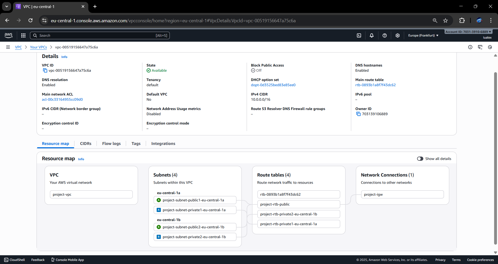

---

### 2. Создана Security Group `web-security-group`

Разрешено:

* inbound: HTTP/80 (0.0.0.0/0)
* inbound: SSH/22 (мой IP)
* outbound: MySQL 3306 → `db-mysql-security-group`

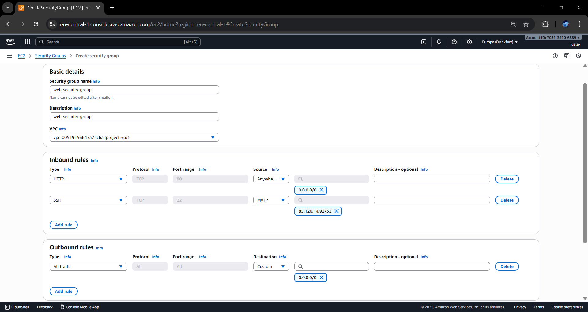

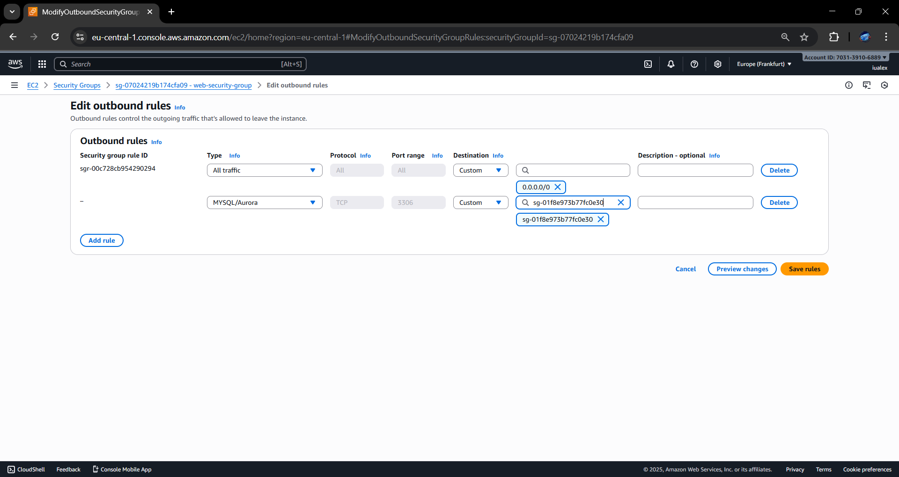

---

### 3. Создана Security Group `db-mysql-security-group`

Разрешено:

* inbound: MySQL 3306 → от `web-security-group`

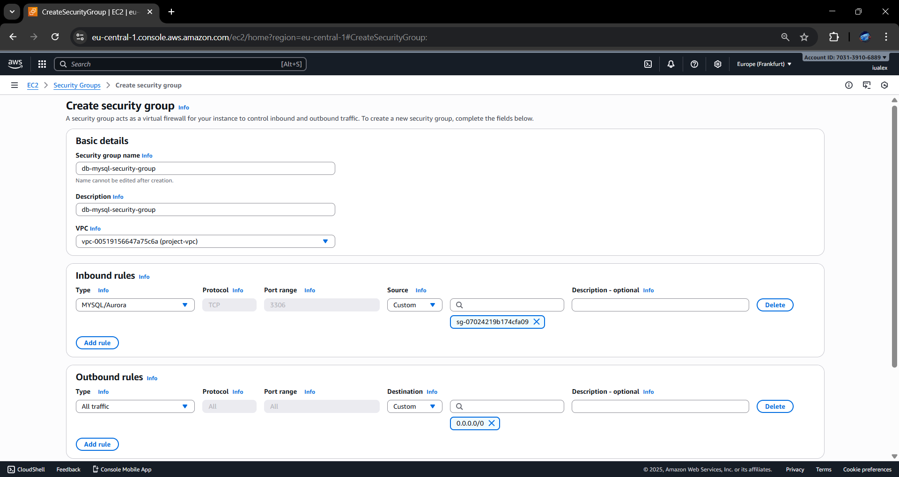

---

### 2. Создан экземпляр Amazon RDS MySQL

Параметры:

* Engine: **MySQL 8.4.7**
* Тип инстанса: **db.t3.micro**
* Хранилище: **20 GB, gp3**
* Авторасширение включено
* Public access: **No**
* Subnet Group: `project-rds-subnet-group`
* Security Group: `db-mysql-security-group`
* Initial DB name: `project_db`
* Identifier: `project-rds-mysql-prod`

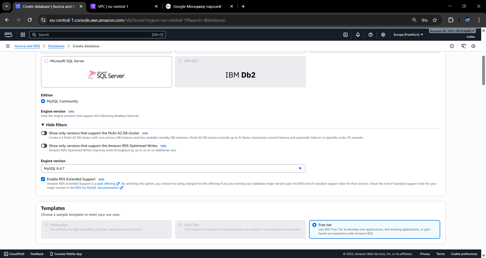

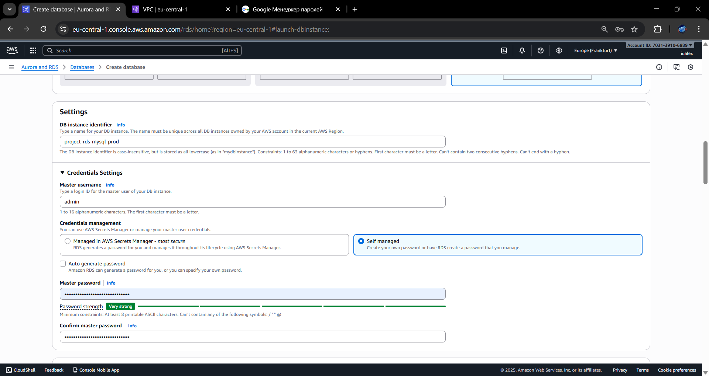

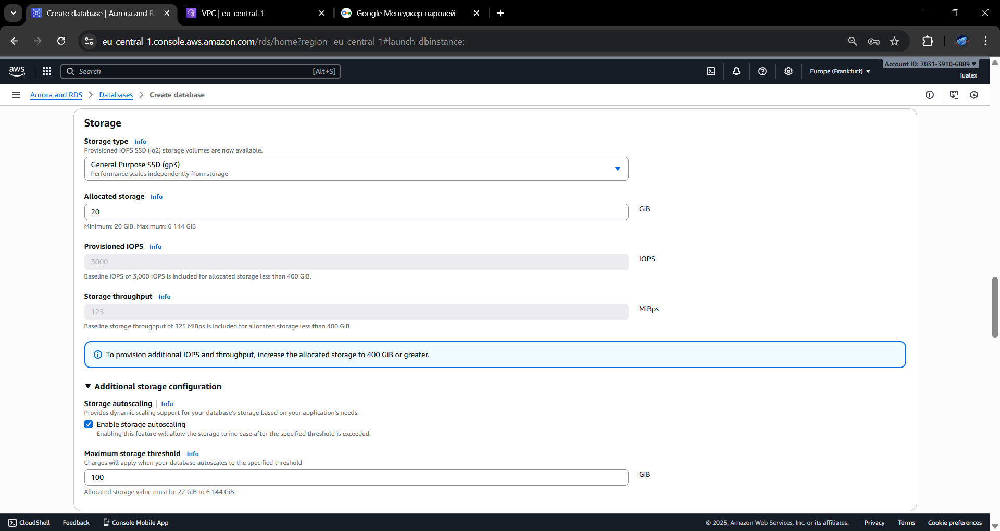

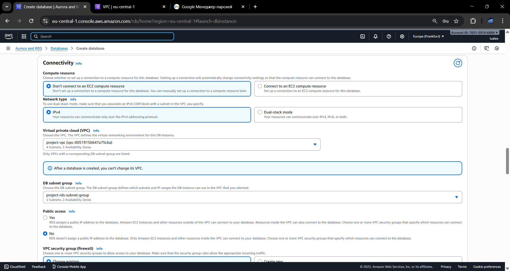

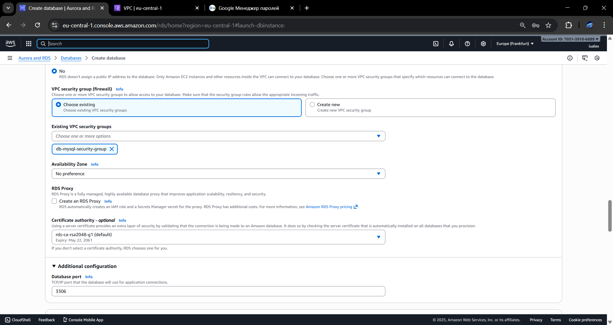

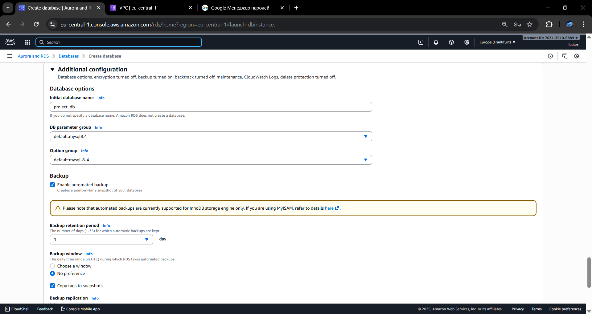

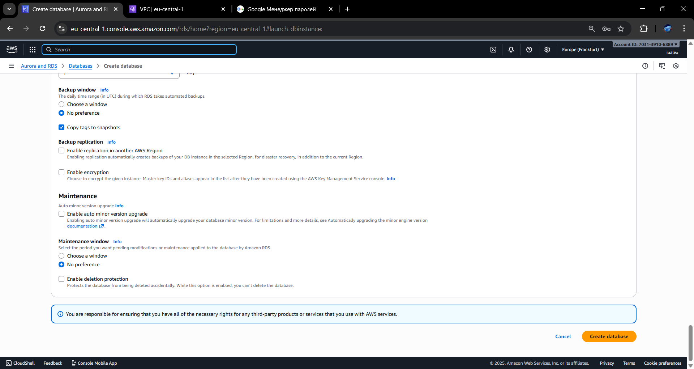

---

# Шаг 3. Создание EC2-сервера и подключение к RDS

Создан EC2:

* Amazon Linux 2023
* subnet: public subnet
* Security group: `web-security-group`

User-data:

```bash
#!/bin/bash
dnf update -y
dnf install -y mariadb105
```

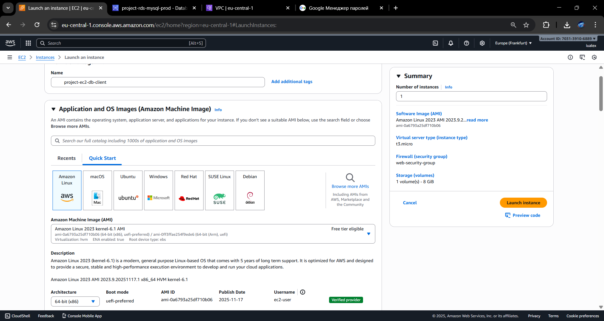

---

## Подключение к базе данных

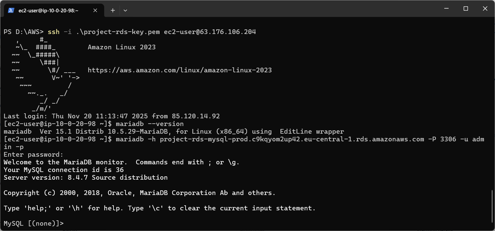

После входа выбрана база:

```sql
USE project_db;
```

---

# Шаг 4. Создание таблиц, вставка данных и JOIN

### Созданы таблицы:

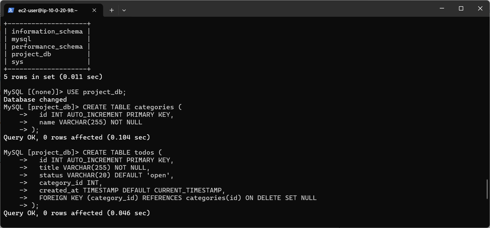

---

### Вставка данных

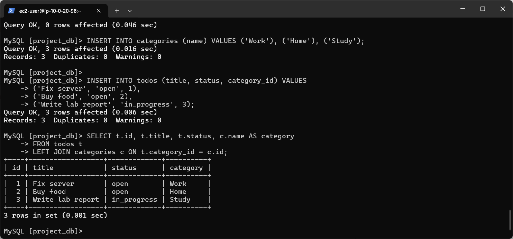

---

### JOIN-запрос

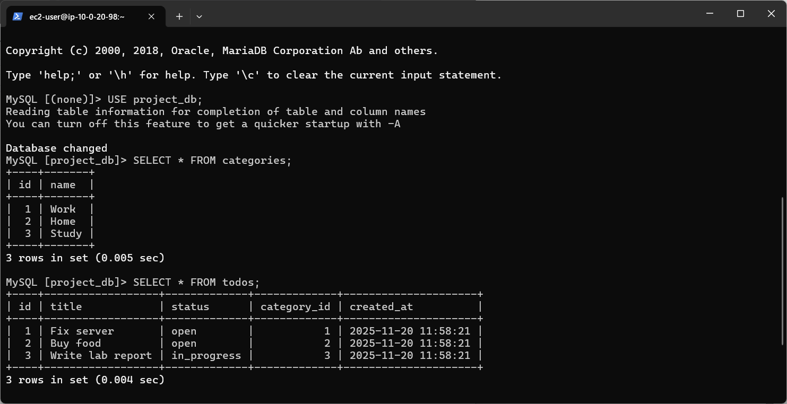

---

# Шаг 5. Создание Read Replica

### Реплика создана:

* Identifier: `project-rds-mysql-read-replica`
* Instance class: `db.t3.micro`
* Public access: No
* Security group: `db-mysql-security-group`

---

### Подключение к реплике

```bash
mysql -h <REPLICA_ENDPOINT> -u admin -p
```

### Контрольные вопросы

**1. Какие данные видны на реплике?**

Все данные основной БД.
**Почему?**
Потому что реплика копирует изменения мастера в режиме read-only.

**2. Можно ли на реплике выполнить INSERT/UPDATE?**

Нет.
**Почему?**
Реплика работает только на чтение — режим *read-only*.

**3. Появляется ли новая запись на реплике после вставки на мастер?**

Да, после небольшой задержки.
**Почему?**
RDS реплика синхронизируется через механизм binlog replication.

---

# Шаг 6. Подключение PHP-приложения к Amazon RDS

Использовано приложение из ЛР4 (CRUD рецептов).

### Изменены конфиги подключения:

**config/database.php:**

```php
<?php
// Настройки подключения к базе данных RDS
define('DB_HOST', 'project-rds-mysql-prod.<region>.rds.amazonaws.com'); // замените <region> на ваш регион
define('DB_NAME', 'project_db');
define('DB_USER', 'admin'); // имя пользователя RDS
define('DB_PASS', 'YourPassword123'); // пароль RDS
define('DB_CHARSET', 'utf8mb4'); // кодировка
```


### Проверкв работы сайт по адресу:

[http://54.93.116.138/index.php](http://54.93.116.138/index.php)

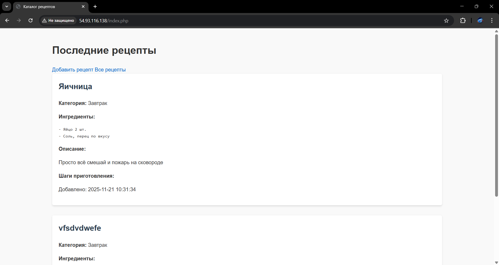

---

# 4. Список использованных источников

1. AWS Documentation – Amazon RDS
2. AWS Documentation – DynamoDB
3. MySQL 8 Documentation
4. Лекции и материалы курса DevOps

---

# 5. Вывод

В ходе лабораторной работы я:

* создал сетевую инфраструктуру AWS (VPC, подсети, SG);
* развернул экземпляр MySQL в Amazon RDS;
* создал Read Replica и проверил её работу;
* подключился с EC2 и выполнил SQL-операции (CRUD, JOIN);
* подключил PHP-приложение к облачной базе данных;
* успешно развернул полностью работающее приложение по внешнему IP;
* понял назначение Read Replicas и основные принципы облачных БД.
