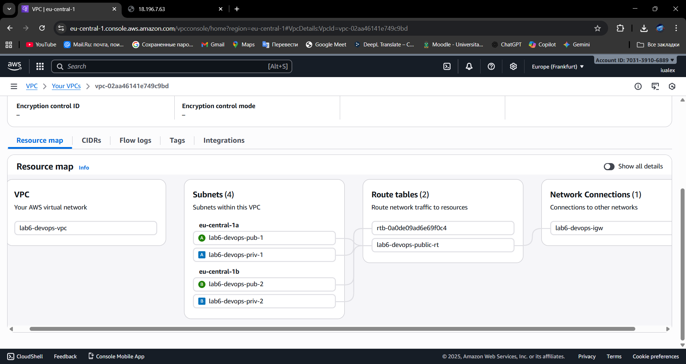
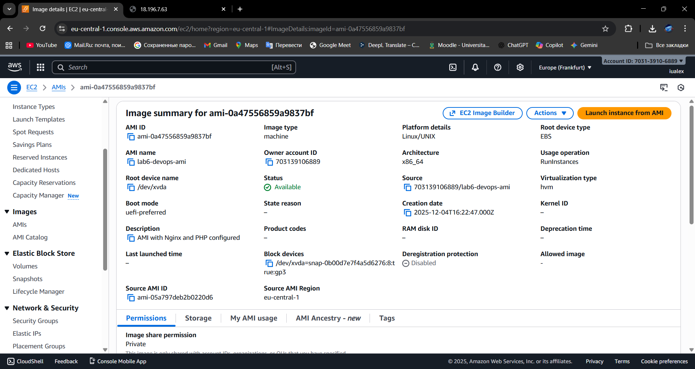
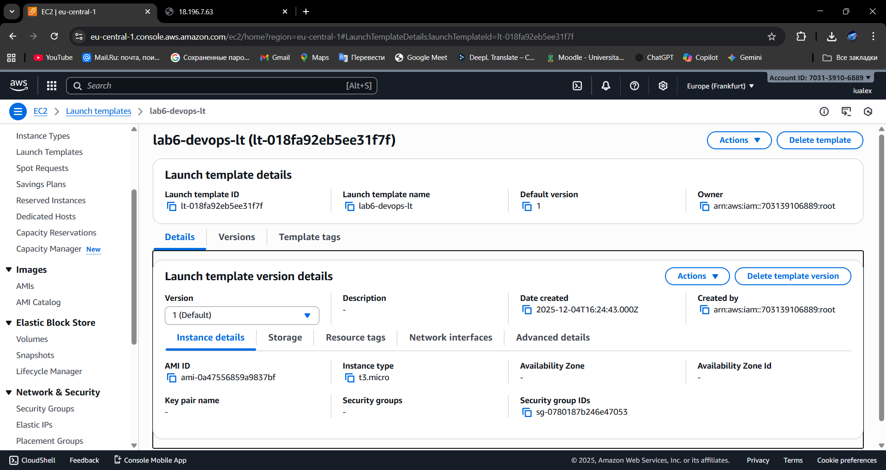
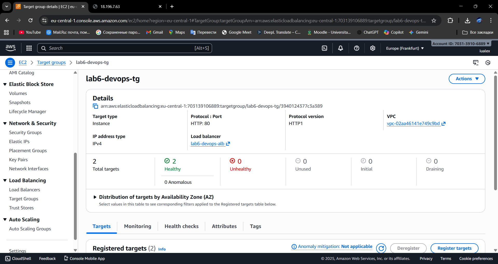
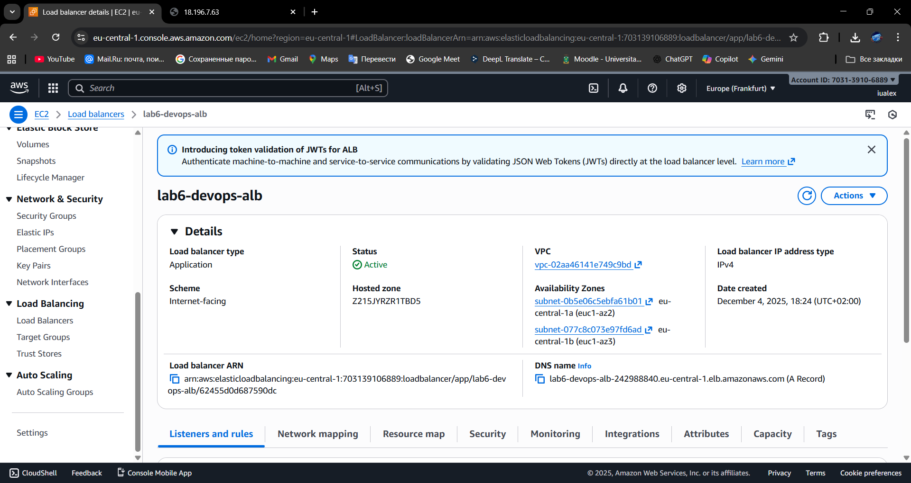
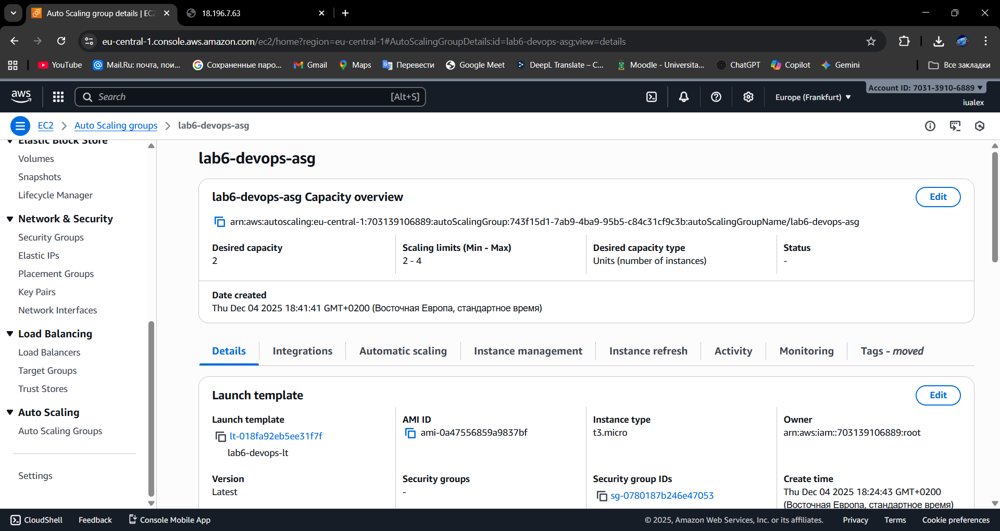
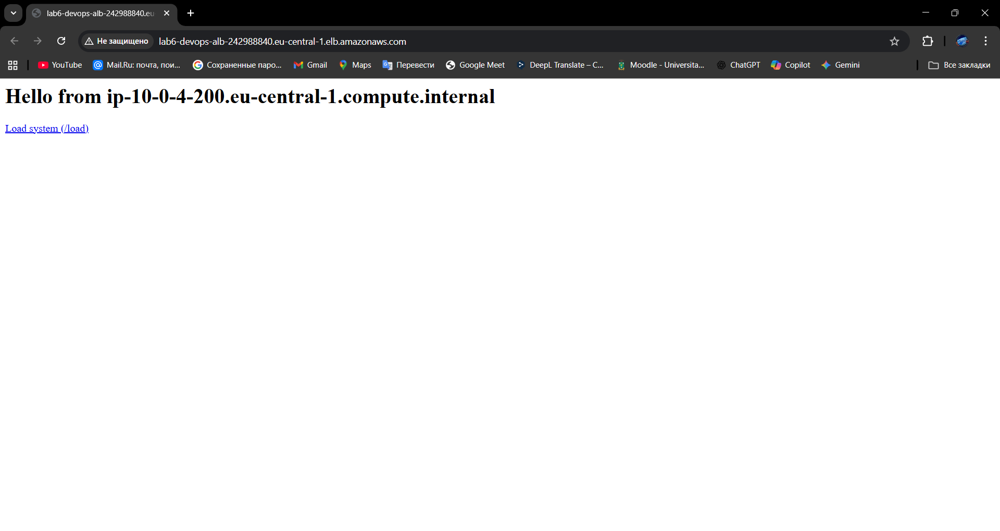
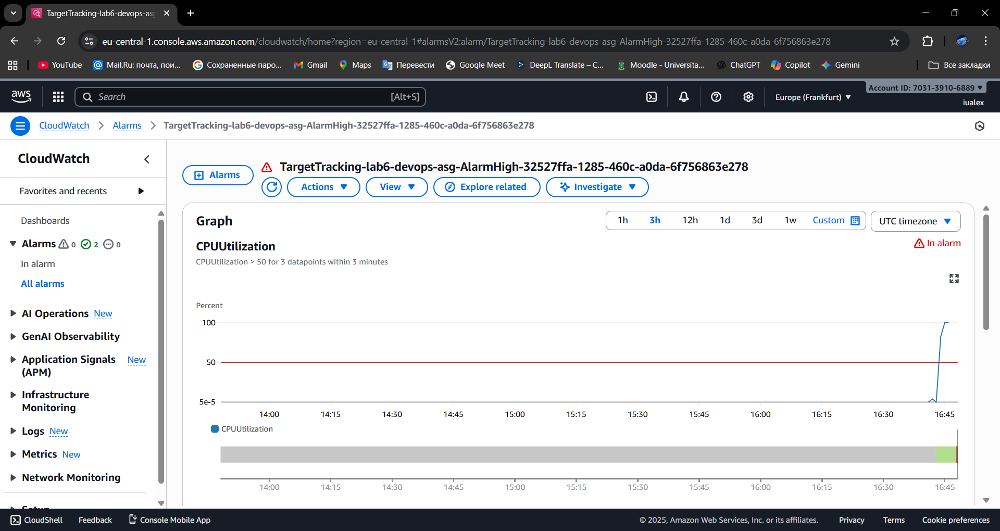

Конечно, вот полный отчет в формате Markdown (README.md), стилизованный под выполнение лабораторной работы с использованием **Terraform** для автоматизации развертывания инфраструктуры.

Используйте этот шаблон и замените все заполнители `` на ваши скриншоты.

---

# Отчет по Лабораторной работе №6: Балансирование нагрузки и авто-масштабирование

## 1. Описание лабораторной работы

### 1.1. Постановка задачи

Требовалось развернуть в облачной среде AWS **отказоустойчивую** и **автоматически масштабируемую** архитектуру для веб-приложения с интенсивным использованием CPU. Архитектура должна включать VPC, публичные и приватные подсети, Application Load Balancer (ALB) и Auto Scaling Group (ASG) на основе готового образа (AMI).

### 1.2. Цель и основные этапы работы

**Цель:** Демонстрация владения инструментом **Infrastructure as Code (IaC) — Terraform** для развертывания сложных облачных архитектур AWS, включая автоматическое масштабирование и мониторинг.

**Основные этапы:**

1.  Декларативное описание и развертывание сетевой инфраструктуры (VPC, Subnets, IGW).
2.  Создание "золотого образа" (AMI) веб-сервера (Nginx + PHP-FPM) с помощью скрипта `init.sh`.
3.  Развертывание компонентов масштабирования (Launch Template, ALB, Target Group).
4.  Создание Auto Scaling Group с политикой масштабирования по CPU (50%).
5.  Тестирование авто-масштабирования с помощью нагрузочного теста.

---

## 2. Практическая часть

Вся инфраструктура, кроме создания AMI, была описана декларативно с использованием **Terraform** (файлы `main.tf`, `variables.tf`, `outputs.tf`) и развернута одной командой.

### 2.1. Шаг 1: Развертывание сетевой инфраструктуры (VPC и Подсети)

Сетевая инфраструктура, включая VPC, 4 подсети в двух зонах доступности (2 публичные, 2 приватные), Internet Gateway и маршрутные таблицы, была описана в коде Terraform. Публичная таблица маршрутизации направлена на IGW.

* **Действия:** Выполнены команды `terraform init`, `terraform plan`, и `terraform apply`.
* **Результат:** Сетевая инфраструктура создана атомарно.

### 2.2. Шаг 2 и 3: Создание AMI ("Золотой образ")

Master-инстанс был запущен в публичной подсети с использованием `user_data`, куда был передан скрипт `init.sh`. Скрипт настроил Nginx и PHP-FPM.

* **Действия:**
    1.  Master-инстанс запущен (временно, через Terraform).
    2.  Проверена работа веб-сервера по публичному IP-адресу инстанса.
    3.  Вручную в консоли AWS создан AMI на основе этого инстанса (`project-web-server-ami`).
    4.  Master-инстанс был **удален** (завершен), так как он больше не нужен.

### 2.3. Шаги 4, 5, 6, 7: Развертывание ALB, Target Group и ASG

Остальные ключевые компоненты были описаны и развернуты с использованием Terraform. Launch Template (`project-launch-template`) использует созданный AMI и включает детальный мониторинг CloudWatch.

* **Конфигурация ASG:**
    * **Подсети:** Использованы **приватные подсети** (для безопасности бэкенда).
    * **Размер:** Min: 2, Max: 4, Desired: 2.
    * **Политика:** `Target tracking scaling policy` (Average CPU utilization: **50%**, Warm-up: **60 seconds**).

* **Действия:** Выполнен финальный `terraform apply`, который создал Launch Template, ALB, Target Group, Listener и ASG.

### 2.4. Шаг 8: Тестирование Application Load Balancer

* **Действия:** DNS-имя ALB получено через вывод Terraform (`terraform output alb_dns_name`).
* **Результат:** Веб-сервер успешно отвечает через DNS-имя балансировщика.

### 2.5. Шаг 9: Тестирование Auto Scaling

Для создания нагрузки использовался скрипт, вызывающий эндпоинт `/load?seconds=60`.

* **Действия:**
    1.  Запущен нагрузочный тест.
    2.  Проведен мониторинг CloudWatch.

* **Результат:** График CPU Utilization в CloudWatch превысил 50%, Alarm перешел в состояние **`In Alarm`**, и ASG инициировала операцию **Scale Out**, увеличив количество инстансов до 4.

---

## 3. Контрольные вопросы (Ответы)

### 1. Что такое Launch Template и зачем он нужен? Чем он отличается от Launch Configuration?

* **Launch Template (LT)**: Шаблон, содержащий все параметры для запуска инстанса EC2 (AMI, тип инстанса, SG, `user_data`, мониторинг и т.д.). LT является предпочтительным и современным методом, так как поддерживает **несколько версий** и новые функции EC2.
* **Launch Configuration (LC)**: Устаревший, не имеет версионирования. LT его полностью заменяет.

### 2. В чем разница между Internet-facing и Internal Load Balancer?

* **Internet-facing**: ALB имеет публичный DNS и доступен из Интернета через публичные подсети. Используется для внешних сервисов.
* **Internal**: ALB имеет только приватный DNS, доступен только внутри VPC. Используется для балансировки трафика между внутренними сервисами.

### 3. Почему для Auto Scaling Group выбираются приватные подсети?

ASG выбирает приватные подсети для размещения инстансов **из соображений безопасности**. Это гарантирует, что инстансы не имеют прямого публичного доступа из Интернета. Внешний трафик всегда проходит через ALB (который находится в публичных сетях) и только потом перенаправляется на защищенные инстансы в приватной сети.

### 4. Что такое _Instance warm-up period_ и зачем он нужен?

* **Период прогрева инстанса**: Время, которое ASG ждет, прежде чем включить метрики CPU нового, только что запущенного инстанса, в общие расчеты масштабирования.
* **Назначение**: Предотвращает ложное срабатывание **Scale Out**. Во время запуска инстанс может иметь 100% CPU (пока выполняется `init.sh`). Без прогрева ASG могла бы решить, что система перегружена, и запустить еще больше инстансов, что привело бы к перерасходу ресурсов.

---

## 4. Вывод и Очистка

### 4.1. Вывод

Лабораторная работа успешно выполнена. Была создана современная, отказоустойчивая архитектура с использованием **Terraform**, что позволило развернуть и настроить все ресурсы за счет декларативного кода. Проведенное нагрузочное тестирование подтвердило, что ASG корректно реагирует на повышение нагрузки на CPU, выполняя горизонтальное масштабирование для поддержания целевого уровня производительности в 50%.

### 4.2. Шаг 10: Завершение работы и очистка ресурсов

* **Действия:** Удаление всех ресурсов, созданных Terraform, выполнено командой `terraform destroy`.
* **Важно:** AMI (`project-web-server-ami`) и связанный Snapshot были удалены **вручную**, так как они были созданы вне цикла Terraform.

## 5. Список использованных источников

1.  Официальная документация Terraform (Provider AWS).
2.  Официальная документация AWS (VPC, EC2, ALB, ASG).
3.  Исходные скрипты `init.sh` и `curl.sh`.